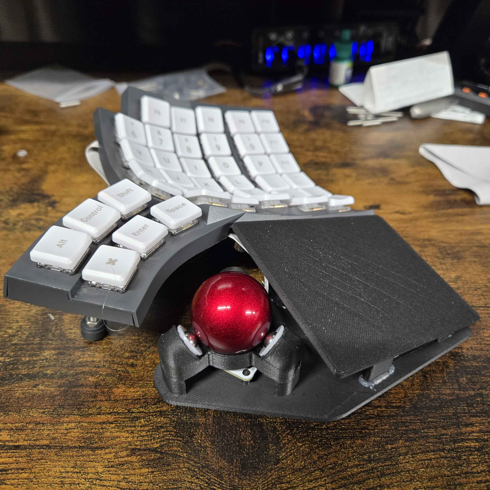
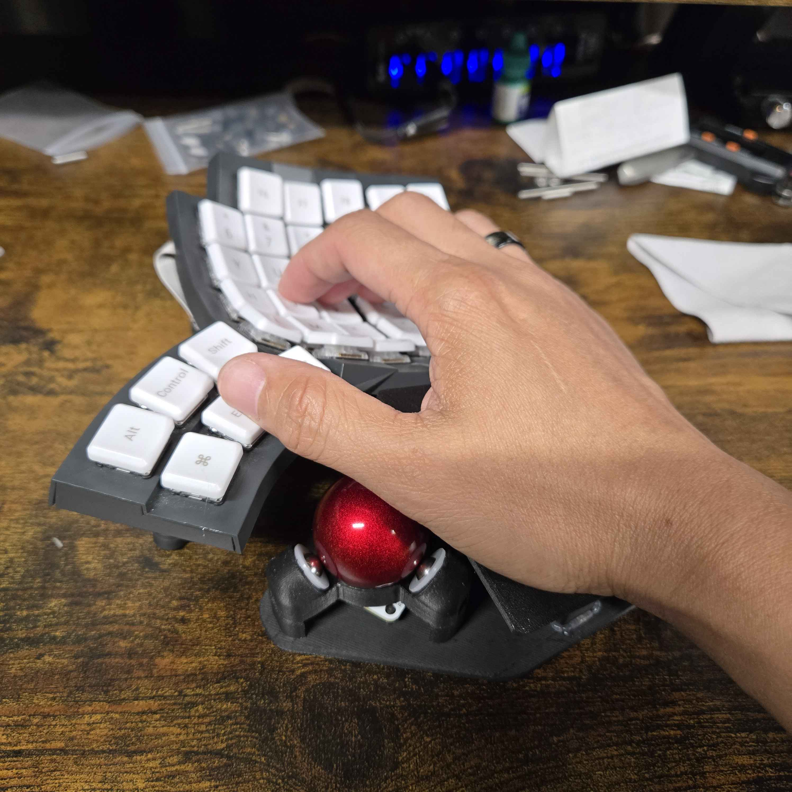
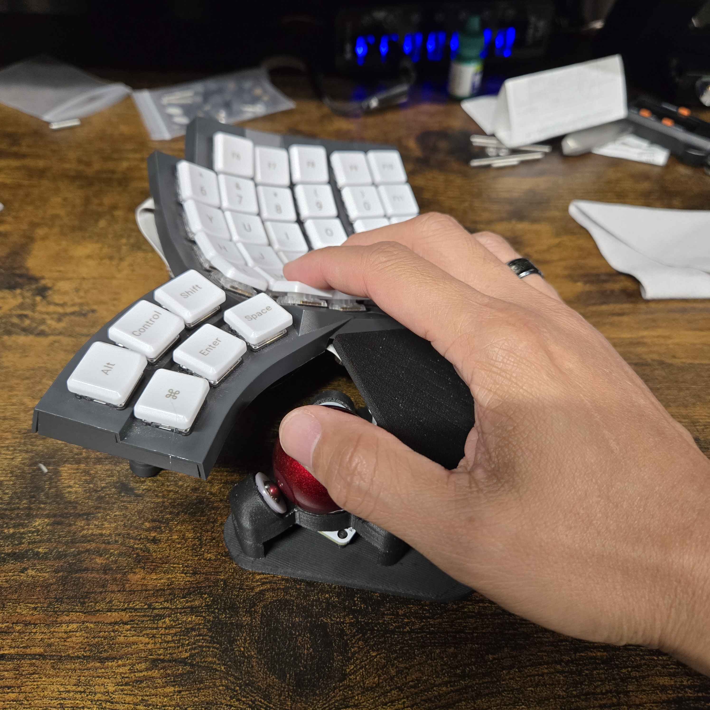
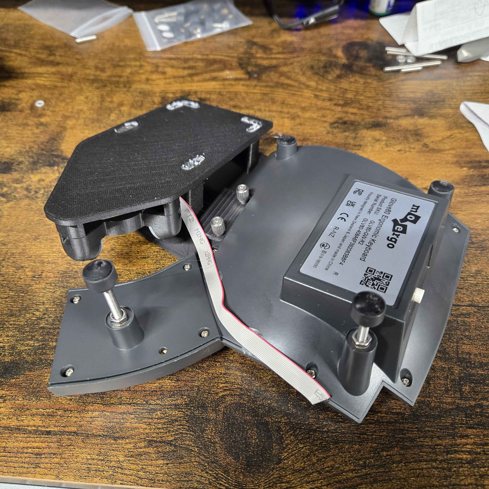

# `west`-based Custom ZMK Configuration for MoErgo Glove80 with Integrated PMW-3610 Optical Driver

This repo is a `west`-based custom ZMK configuration using [official Glove80 ZMK distribution](https://github.com/moergo-sc/zmk) with integrated [ZMK PMW3610 optical driver](https://github.com/badjeff/zmk-pmw3610-driver) by badjeff

This configuration is customize for my glove80 with integrated trackball on the right hand. Mouse buttons on this keymap is located on the bottom rows of the right hand. Scroll mode is activaed by holding lower layer

  
  
  
  

# WARNING!!!!!!!!!!!!
## Attaching peripherals on the GPIO of the glove80 is an automatic void of warranty

## Instructions
1. Log into, or sign up for, your personal GitHub account.
2. Create your own repository using this repository as a template ([instructions](https://docs.github.com/en/repositories/creating-and-managing-repositories/creating-a-repository-from-a-template])) and check it out on your local computer.
3. Add your chosen configuration such as keymap to the `config` directory as described in [the ZMK documentation](https://zmk.dev/docs/user-setup)
4. Commit and push your changes to your personal repo. Upon pushing it, GitHub Actions will start building a new version of your firmware with the updated keymap.

## Firmware Files
To locate your firmware files and reflash your Glove80:
1. log into GitHub and navigate to your personal config repository you just uploaded your keymap changes to.
2. Click "Actions" in the main navigation, and in the left navigation click the "Build" link.
3. Select the desired workflow run in the centre area of the page (based on date and time of the build you wish to use). You can also start a new build from this page by clicking the "Run workflow" button.
4. After clicking the desired workflow run, you should be presented with a section at the bottom of the page called "Artifacts". This section contains the results of your build, in a file called `firmware.zip`.
5. Download `firmware.zip` and extract it to reveal two files, `glove80_lh-zmk.uf2` and `glove80_rh-zmk.uf2`: these are the firmware for the left and right sides of the keyboard respectively.
6. Flash the firmware to Glove80 according to the user documentation on the official Glove80 Support website (linked above). *Note that unlike firmware built with the standard Glove80 toolchain, you must select the correct firmware file to upload to each half of the keyboard.*

Your keyboard is now ready to use.
